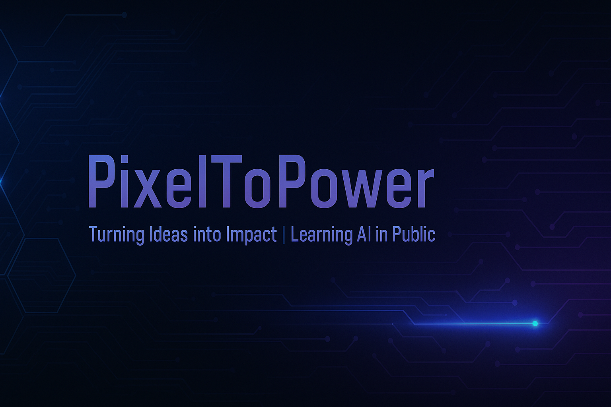

  

# 👋 Hi, I'm Akshat — aka PixelToPower

I'm on a bold journey to rise into the **top 0.001%** of creators and coders — one line at a time.

This profile tracks my progress through the **Titan Path Plan**, my personal system of growth in:
- 🧠 AI & Python
- 🛠️ Real-world tools and projects
- 🚀 Consistency and public accountability

---

### 🔁 What I'm Doing Now
- 📘 Learning Python and AI daily
- 🧪 Sharing experiments and projects in public
- 🧱 Building a foundation for long-term mastery

---

### 🛠️ My Repositories
- **titan-path-log** – daily/weekly logs of progress
- **python-core-projects** – real Python tools I build
- **ai-learning-lab** – where I experiment with AI/ML

---

### 🌐 Follow My Journey
- Twitter: [@PixelToPower](https://twitter.com/PixelToPower)
- Hashtag: `#TitanPath`
- ## 🔗 Featured Project--> https://replit.com/@akshatpanchal00/AI-Portfolio-Project-Titan-Path?v=1
From pixels to power. From clarity to code.  
Let’s build the future, brick by brick. 🧱
